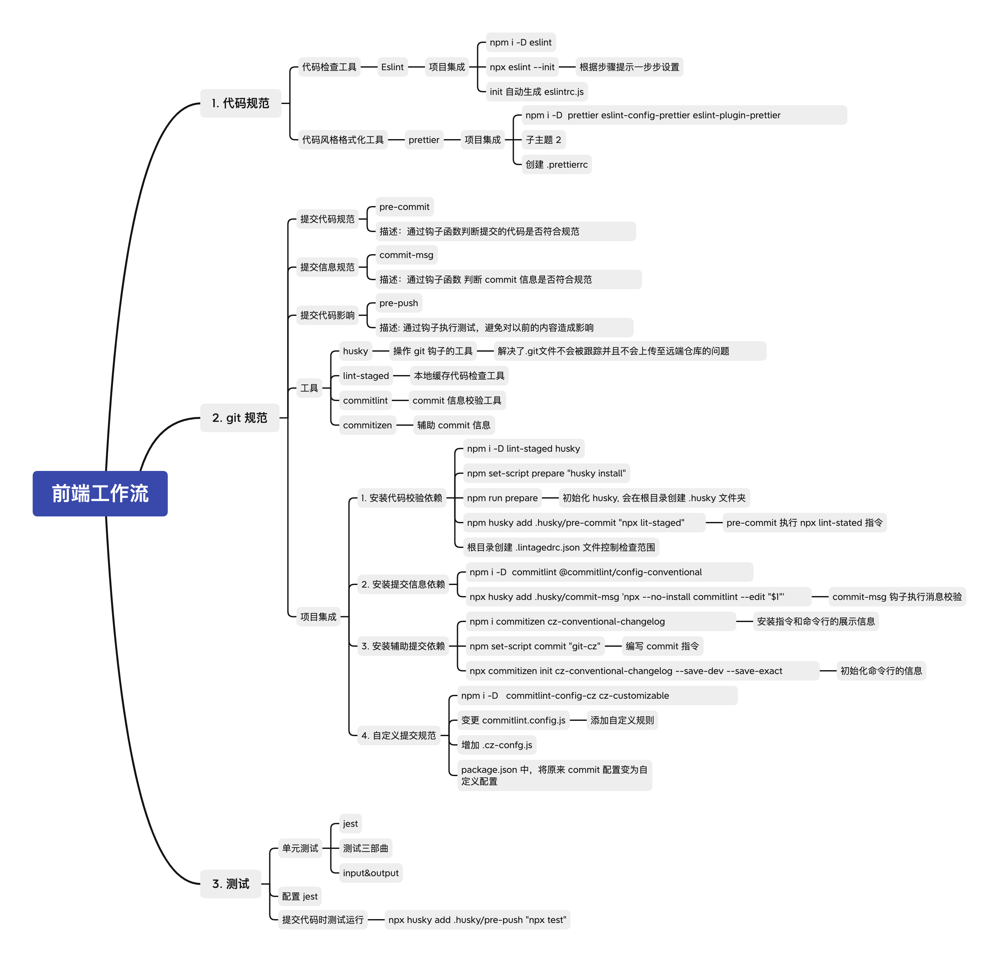

# Frontend Workflow Tmplate

### 增产提效

**1. eslint + vscode**

- 1. 在 vscode 上安装 eslint 插件
- 2. 每次保存的时候根据根目录下 .eslint.js 配置自我修正

文件 > 首选项 > 设置

```js
    "files.autoSave":"off",
    "eslint.validate": [
       "javascript",
       "javascriptreact",
       "html",
       { "language": "vue", "autoFix": true }
     ],
     "eslint.options": {
        "plugins": ["html"]
     }
```

**2. 配置 .editorconfig 文件**

配置开发时文件代码规范,保持多人开发一致编码样式

**工作流**



- [xmind 文件](./doc/前端工作流.xmind)
- [pdf](./doc/commit规范方案探讨.pdf)

**疑问**

eslint --fix 和 prettier 都可以实现格式化代码，它们之间有什么区别

**参考**

- Npm Life Cycle Scripts https://docs.npmjs.com/cli/v7/using-npm/scripts#life-cycle-scripts

- npm 模块管理器 http://javascript.ruanyifeng.com/nodejs/npm.html
- package.json 介绍 http://javascript.ruanyifeng.com/nodejs/packagejson.html
